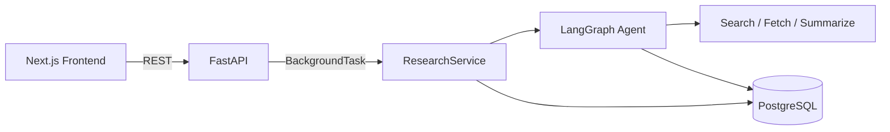

# ResearchPilot AI

A full-stack, tool-using AI research agent. Ask it a question; it
autonomously searches the web, fetches candidate pages, extracts evidence
with Gemini, and returns an answer in which **every factual claim is
traceable to a specific fetched source** — enforced in code, not just
prompted for.

Built with **Next.js + TypeScript + Redux Toolkit** (frontend),
**FastAPI + LangGraph + Gemini** (backend), and **PostgreSQL** (storage) —
containerized, tested, and CI'd.

---

## Overview

The system is orchestrated by a real **LangGraph state graph** — not a
`while` loop — with a hard, code-enforced step limit that guarantees
termination regardless of what any tool or LLM call does. Three tools
(web search, page fetch, Gemini-powered summarization) feed an evidence
pipeline that grounds the final answer, and a dedicated citation-validation
stage rejects any claim that can't be traced back to a source the system
actually fetched: **NO SOURCE = NO CLAIM**.

## Problem

General LLM chat interfaces answer research questions from parametric
memory alone, which means hallucination, staleness past the training
cutoff, and no way for the reader to verify anything. ResearchPilot AI
solves this by making every claim in its output resolve to a real,
persisted chain: `claim → evidence → fetched source → URL`.

## Solution

A LangGraph agent plans and executes multi-step research (search → fetch →
summarize, repeated as needed, bounded by a step budget), persists every
tool call and source to PostgreSQL as it goes, synthesizes a final answer
from only the evidence it gathered, validates every claim against that
evidence before returning it, and exposes the whole trace over a REST API
that a live-updating Next.js frontend polls to show the agent working in
real time.

## Features

- Autonomous multi-step research via a real LangGraph `StateGraph`
- Hard, programmatically-enforced step limit — guaranteed termination
- Three real tools: web search, page fetch, Gemini-powered evidence extraction
- Citation validation stage: claims without a fetched source are dropped
- Graceful handling of every failure mode (search/fetch/LLM failures, empty
  results, no evidence) — never fabricates an answer
- Live research workspace UI (status, step counter, tool-call timeline)
- Full evidence trail UI: claim → citations → source → URL
- PostgreSQL persistence with Alembic migrations (SQLite for zero-config dev/tests)
- 37 backend tests + 10 frontend tests, all passing, zero live network calls
- Docker Compose (3 services) + 3 GitHub Actions CI workflows

## Architecture



Full system design, all diagrams, and the reasoning behind every major
decision (including *why no vector database*) are in
[`docs/SYSTEM_DESIGN.md`](docs/SYSTEM_DESIGN.md).

## Agent Workflow

```
START → planner → {search | fetch | summarize} → planner → ... → finish → END
```

`planner` is the only node with routing authority and the only place
`step_count` is incremented — the moment it exceeds `max_steps`, the graph
routes to `finish` unconditionally. See
[`docs/SYSTEM_DESIGN.md` §7–8](docs/SYSTEM_DESIGN.md#7-agentic-ai-architecture)
for the full design and the hard-step-limit guarantee, verified in
[`tests/test_agent_graph.py`](backend/tests/test_agent_graph.py).

## LangGraph

`backend/app/agent/graph.py` builds a real `langgraph.graph.StateGraph` —
not a simulated one. Database sessions/repositories are injected via an
`AgentContext` closure so the graph itself stays pure, JSON-serializable
state (`ResearchState`, a `TypedDict`), which is what makes it possible to
unit-test the agent graph directly with mocked tools, independent of the
API layer.

## Three Tools

| Tool | File | Real call made |
|---|---|---|
| Web Search | `backend/app/tools/web_search.py` | Google Custom Search API |
| Fetch Page | `backend/app/tools/fetch_page.py` | `httpx` GET to the target URL (SSRF-checked first) |
| Summarize | `backend/app/tools/summarize.py` | Gemini structured evidence extraction |

Each tool's `execute()` never raises — every failure mode (timeout, HTTP
error, malformed response, SSRF block) is converted to a typed
`success=False` response, tested explicitly in
[`tests/test_tools.py`](backend/tests/test_tools.py).

## RAG Pipeline

```
Question → Search → Fetch Pages → Clean → Extract Evidence (Gemini)
  → Store Evidence → Build Claim/Evidence Map → Generate Answer (Gemini)
  → Validate Citations → Return Answer
```

No vector database is used — the evidence set for one research run is a
handful of freshly fetched pages that live only for that run's duration, so
there's no persistent corpus to build an ANN index over. See
[`docs/SYSTEM_DESIGN.md` §10](docs/SYSTEM_DESIGN.md#10-rag--evidence-pipeline)
for the full reasoning and what would change that calculus.

## Citation System

Every persisted `Claim` has one or more `ClaimSource` rows (source id,
evidence snippet, citation number, confidence), enforced at three
independent layers (agent graph → `CitationIntegrationService.validate_answer`
→ `ResearchService._persist_claims`), so **NO SOURCE = NO CLAIM** holds even
if any single layer's check were ever wrong. Full design in
[`docs/SYSTEM_DESIGN.md` §11](docs/SYSTEM_DESIGN.md#11-citation-and-claim-traceability).

## Gemini Integration

Google Gemini is the **only** LLM provider, used in exactly two places:
evidence extraction (`SummarizationTool`) and final-answer synthesis
(`ResearchService._generate_answer`), the latter falling back to a safe,
purely extractive answer if the Gemini call itself fails. See
[`docs/BACKEND_DOCUMENTATION.md` §10](docs/BACKEND_DOCUMENTATION.md#10-why-gemini).

## Frontend

Next.js 14 (App Router) + TypeScript + Tailwind + Redux Toolkit. Three
screens: Home (question form), Research Workspace (live status/steps/tool
timeline while running), Research Results (final answer + full citation
trail). Full breakdown in
[`docs/FRONTEND_DOCUMENTATION.md`](docs/FRONTEND_DOCUMENTATION.md).

## Backend

FastAPI, strictly layered (API → Services → Agent → Tools/Repositories →
Database), fully async throughout. Full breakdown in
[`docs/BACKEND_DOCUMENTATION.md`](docs/BACKEND_DOCUMENTATION.md).

## Database

PostgreSQL (SQLite for dev/tests) via SQLAlchemy 2.x + Alembic. Five tables:
`research_runs`, `sources`, `tool_calls`, `claims`, `claim_sources`. Full ER
diagram in
[`docs/SYSTEM_DESIGN.md` §15](docs/SYSTEM_DESIGN.md#15-postgresql-data-architecture).

## API

Six REST endpoints under `/api/v1` + `/health`. Full reference with example
requests/responses in [`docs/API_DOCUMENTATION.md`](docs/API_DOCUMENTATION.md),
interactive docs at `GET /docs` on a running instance.

```
POST /api/v1/research
GET  /api/v1/research/{id}
GET  /api/v1/research/{id}/sources
GET  /api/v1/research/{id}/tools
GET  /api/v1/research/{id}/claims
GET  /health
```

## Project Structure

```
researchpilot-ai/
├── backend/
│   ├── app/
│   │   ├── main.py, core/, api/routes/, schemas/
│   │   ├── agent/          LangGraph state + graph
│   │   ├── tools/          web_search, fetch_page, summarize
│   │   ├── services/       research_service, citation_integration
│   │   ├── repositories/   research, source, tool_call, claim
│   │   └── db/             models, database, base
│   ├── alembic/            migrations
│   ├── tests/              37 tests
│   ├── requirements.txt, Dockerfile
├── frontend/
│   ├── src/app/             App Router pages
│   ├── src/components/      HomePage, ResearchWorkspace, ResearchResults
│   ├── src/store/            Redux slice
│   ├── src/hooks/             useResearchAPI
│   ├── package.json, Dockerfile
├── docs/                      System design, frontend/backend docs, guides
├── examples/                  3 example runs + reproducible generator
├── .github/workflows/         backend.yml, frontend.yml, docker.yml
├── docker-compose.yml
└── .env.example
```

## Environment Variables

See [`.env.example`](.env.example) for the full, documented list. Minimum to
run for real (non-mocked) research: `GEMINI_API_KEY`, `SEARCH_API_KEY`,
`SEARCH_ENGINE_ID`, `SECRET_KEY`, `DATABASE_URL`.

## Installation

```bash
git clone <repo-url> researchpilot-ai && cd researchpilot-ai
cp .env.example .env   # then fill in real API keys
docker compose up --build
```

Frontend: http://localhost:3000 · Backend docs: http://localhost:8000/docs

Full setup instructions (Docker and manual) in
[`docs/SETUP_GUIDE.md`](docs/SETUP_GUIDE.md).

## Local Development

```bash
# Backend
cd backend && pip install -r requirements.txt
alembic upgrade head   # if using Postgres; skip for SQLite dev
uvicorn app.main:app --reload

# Frontend
cd frontend && npm install && npm run dev
```

## Docker

```bash
docker compose up --build     # postgres + backend + frontend
docker compose down -v         # stop and remove volumes
```

Both Dockerfiles run as non-root users with container healthchecks. Full
details in [`docs/DEPLOYMENT_GUIDE.md`](docs/DEPLOYMENT_GUIDE.md).

## Testing

```bash
cd backend && pytest tests/ -v          # 37 tests, offline, mocked network
cd frontend && npm test                  # 10 tests
cd frontend && npm run lint && npm run type-check && npm run build
```

All backend tests mock every external call (Google Search, page fetch,
Gemini) so the suite is deterministic and requires no API keys or network
access. Test breakdown in
[`docs/BACKEND_DOCUMENTATION.md` §21](docs/BACKEND_DOCUMENTATION.md#21-testing)
and [`docs/FRONTEND_DOCUMENTATION.md` §16](docs/FRONTEND_DOCUMENTATION.md#16-testing).

## CI/CD

Three GitHub Actions workflows in `.github/workflows/`: `backend.yml`
(install → lint → type-check → pytest against a real Postgres service
container → Docker build), `frontend.yml` (install → lint → type-check →
jest → build → Docker build), `docker.yml` (build both images on
`main`/tags).

## Example Runs

Three complete, real (not hand-written) example runs — captured from the
actual system with the external network calls substituted for
reproducibility, since real API keys aren't available in every environment:

1. [`examples/EXAMPLE_1_RAG.md`](examples/EXAMPLE_1_RAG.md) — *What is RAG
   and why is it useful for LLM applications?*
2. [`examples/EXAMPLE_2_LANGGRAPH.md`](examples/EXAMPLE_2_LANGGRAPH.md) —
   *What are the main differences between LangGraph and traditional LLM
   chains?*
3. [`examples/EXAMPLE_3_HALLUCINATION.md`](examples/EXAMPLE_3_HALLUCINATION.md)
   — *What are current techniques for reducing LLM hallucinations?*
   (multi-source, uses the full step budget, exercises citation validation
   at scale)

See [`examples/generator/README.md`](examples/generator/README.md) to
reproduce them yourself.

## Assessment Requirement Mapping

| Requirement | Where |
|---|---|
| LangGraph state graph (not a while-loop) | `backend/app/agent/graph.py`; design in `docs/SYSTEM_DESIGN.md` §7–8 |
| Hard step limit, guaranteed termination | `planner_node` in `graph.py`; tested in `test_hard_step_limit_guarantees_termination` |
| 3 tools (search/fetch/summarize) | `backend/app/tools/*.py`; tested in `test_tools.py` |
| RAG / evidence grounding | `citation_integration.py` + `ResearchService._generate_answer`; `docs/SYSTEM_DESIGN.md` §10 |
| Citation/claim traceability, NO SOURCE = NO CLAIM | `docs/SYSTEM_DESIGN.md` §11; `ResearchService._persist_claims` |
| Citation validation stage | `CitationIntegrationService.validate_answer` |
| Failure handling (search/fetch/LLM/timeout/empty/step-limit) | `docs/SYSTEM_DESIGN.md` §16; `test_agent_graph.py`, `test_tools.py` |
| PostgreSQL + Alembic | `backend/app/db/models.py`, `backend/alembic/` |
| FastAPI, versioned REST API | `backend/app/api/routes/research.py`; `docs/API_DOCUMENTATION.md` |
| Next.js + TypeScript + Redux frontend | `frontend/src/` |
| Docker + Docker Compose | `docker-compose.yml`, both `Dockerfile`s |
| CI/CD | `.github/workflows/` |
| Testing (tools/agent/step-limit/citation/API/integration) | `backend/tests/` (37 tests), `frontend/src/__tests__/` (10 tests) |
| 18-page system design doc | `docs/SYSTEM_DESIGN.md` |
| Frontend/backend documentation | `docs/FRONTEND_DOCUMENTATION.md`, `docs/BACKEND_DOCUMENTATION.md` |
| 3 example runs | `examples/` |
| Google Gemini only | `backend/app/tools/summarize.py`, `research_service.py` — no other provider anywhere in the codebase |

## Security

No secrets in source control (`.env.example` documents every variable);
SSRF-aware URL validation before every page fetch; sanitized `500`
responses (no leaked stack traces); non-root Docker containers. Full policy
and known limitations (e.g. the DNS-rebinding edge case in the SSRF check)
in [`docs/SYSTEM_DESIGN.md` §16](docs/SYSTEM_DESIGN.md#16-security--failure-handling).

## Production Considerations

Use a real ASGI production server (`gunicorn` + `uvicorn` workers, not
`--reload`), run `alembic upgrade head` as an explicit release step, restrict
CORS to your real frontend origin, and see
[`docs/DEPLOYMENT_GUIDE.md`](docs/DEPLOYMENT_GUIDE.md) for the full
checklist and scaling notes (including why `BackgroundTasks` should become a
real task queue for a multi-replica deployment).

## Future Improvements

- Persistent cross-run evidence via pgvector (the point at which a vector
  database would actually be justified — see `docs/SYSTEM_DESIGN.md` §18)
- Streaming progress (SSE/WebSocket) instead of polling
- Parallel tool calls for independent sources within a step
- Resolve-then-validate SSRF checks (close the DNS-rebinding gap)
- Replace `BackgroundTasks` with a real task queue for multi-replica deployments

## License

Custom License — Educational & Learning Use Only

Copyright (c) 2026 Zain Ul Abdin Ghani

This project was created by Zain Ul Abdin Ghani (Full-Stack AI Engineer, Computer Science Graduate) as an internship project.

Permission is hereby granted to view, study, and inspect the code for educational and learning purposes only.

RESTRICTIONS:
1. Copying, duplicating, modifying, redistributing, or re-using any part of this source code or documentation for commercial or non-commercial purposes is strictly prohibited without explicit written consent from the author.
2. Direct plagiarism or claiming ownership of this codebase is strictly forbidden.

THE SOFTWARE IS PROVIDED "AS IS", WITHOUT WARRANTY OF ANY KIND.
