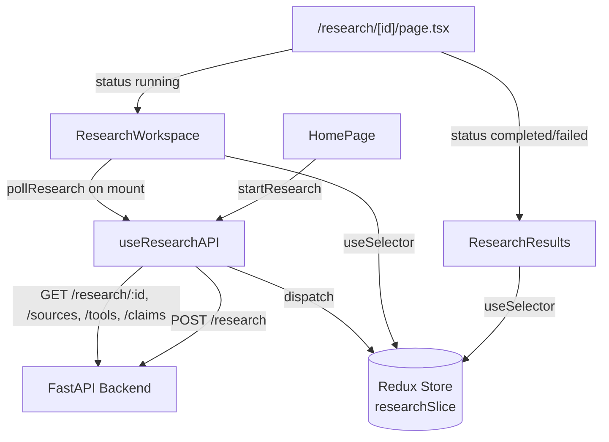

# ResearchPilot AI — Frontend Technical Documentation

**Stack:** Next.js 14 (App Router) · TypeScript · React 18 · Tailwind CSS · Redux Toolkit

---

## Table of Contents

1. [Frontend Overview](#1-frontend-overview)
2. [Why Next.js](#2-why-nextjs)
3. [Why TypeScript](#3-why-typescript)
4. [Why React](#4-why-react)
5. [Why Tailwind CSS](#5-why-tailwind-css)
6. [Why Redux Toolkit](#6-why-redux-toolkit)
7. [Frontend Architecture](#7-frontend-architecture)
8. [Folder Structure](#8-folder-structure)
9. [Component Architecture](#9-component-architecture)
10. [API Integration](#10-api-integration)
11. [State Management](#11-state-management)
12. [Research Workflow UI](#12-research-workflow-ui)
13. [Citation UI](#13-citation-ui)
14. [Error Handling](#14-error-handling)
15. [Security Considerations](#15-security-considerations)
16. [Testing](#16-testing)
17. [Build Process](#17-build-process)
18. [Production Deployment](#18-production-deployment)
19. [Complete Frontend Summary](#19-complete-frontend-summary)
20. [What Was Used and Why](#20-what-was-used-and-why)

---

## 1. Frontend Overview

The frontend is a Next.js single-page application with three real screens
(Home, Research Workspace, Research Results — the "Source Details" and
"Error State" requirements are satisfied inline within the Workspace/Results
views rather than as separate routes, since every source already carries its
fetch status and every error is shown in context) that talks to the FastAPI
backend exclusively over REST. It is not a static site: the workspace view
polls the backend live while an agent run is in progress, so the UI is a
direct, real-time reflection of the LangGraph agent's persisted state, not a
mocked progress bar.

## 2. Why Next.js

Next.js was specified by the project stack and is the right choice for this
app regardless: the **App Router** gives file-based routing for the two real
pages (`/` and `/research/[id]`) without hand-rolling a router, server-side
rendering/static optimization for the home page (see the build output in
§17 — `/` is prerendered as static content), and a built-in API-route
mechanism used here for the container health check
(`app/api/health/route.ts`) without needing a second tiny server. Because
the backend already speaks REST, Next.js is used purely as a frontend
framework here — there is no Node/Express layer, consistent with the
project's "Next.js is ONLY the frontend framework" constraint.

## 3. Why TypeScript

Every piece of state that crosses the API boundary (a research run, a
source, a tool call, a claim with its citations) has a fixed, non-trivial
shape. TypeScript catches shape mismatches between what `useResearchAPI`
parses out of a response and what `researchSlice`'s reducers and the
components expect, at compile time — which is exactly the class of bug that
showed up (and was fixed) during development: see §17 for the two real
compile errors caught by `tsc --noEmit` before they could ship.

## 4. Why React

Server state (the research run) changes over time via polling, and the UI
needs to re-render several independent sections (status header, stats grid,
tool timeline, source list) whenever any part of that state updates. React's
component model plus `react-redux`'s `useSelector` gives each component a
narrow, independently-reactive slice of that state without prop-drilling the
whole run object through every level.

## 5. Why Tailwind CSS

Utility classes let the three main components (each a fairly information-dense
dashboard-style view: stat grids, status badges, timelines) be styled
in-place without maintaining a parallel CSS file per component, and the
generated CSS is purged to only the classes actually used (see the `content`
globs in `tailwind.config.js`), keeping the shipped CSS small — the
production build's shared JS is ~87KB and the page-specific bundles are all
under 4KB (§17 build output).

## 6. Why Redux Toolkit

Research run state (question, status, steps, sources, tool calls, claims) is
genuinely global to the `/research/[id]` route — both `ResearchWorkspace`
and `ResearchResults` need the same data, and polling updates need to be
visible to whichever of the two is currently mounted. Redux Toolkit's
`configureStore` + a single `researchSlice` gives one predictable place
(`researchSlice.ts`) for every reducer that mutates run state, with the
`@reduxjs/toolkit` `createSlice` API avoiding Redux's classic action-type
boilerplate.

## 7. Frontend Architecture



`useResearchAPI` is the single seam between the UI and the network — no
component calls `fetch`/`axios` directly. This means every screen's data
requirements are expressed as Redux state reads (`useSelector`), and the
*only* place that needs to change if the API contract changes is the hook.

## 8. Folder Structure

```
frontend/
├── src/
│   ├── app/
│   │   ├── layout.tsx              Root layout + <Providers>
│   │   ├── providers.tsx           'use client' Redux <Provider> wrapper
│   │   ├── page.tsx                 Home route -> <HomePage />
│   │   ├── globals.css              Tailwind directives
│   │   ├── api/health/route.ts      Container liveness endpoint
│   │   └── research/[id]/page.tsx   Workspace <-> Results switch
│   ├── components/
│   │   ├── HomePage.tsx
│   │   ├── ResearchWorkspace.tsx
│   │   └── ResearchResults.tsx
│   ├── store/
│   │   ├── index.ts                 configureStore + RootState/AppDispatch types
│   │   └── researchSlice.ts
│   ├── hooks/
│   │   └── useResearchAPI.ts
│   ├── types/
│   │   └── jest-dom.d.ts            Ambient types for jest-dom matchers
│   └── __tests__/
│       └── components.test.tsx
├── public/
│   └── robots.txt
├── next.config.js
├── tailwind.config.js
├── postcss.config.js
├── tsconfig.json
├── jest.config.js
├── jest.setup.js
├── .eslintrc.json
├── package.json
└── Dockerfile
```

## 9. Component Architecture

- **`HomePage`** — a controlled form (question textarea + max-steps range
  slider) with client-side validation (empty question, 500-char limit)
  mirroring the backend's own validation, so obviously-invalid requests
  never round-trip to the API. On submit, calls `useResearchAPI().startResearch`
  and routes to `/research/{id}` on success.
- **`ResearchWorkspace`** — mounted while a run is in progress. Starts
  polling on mount (`useEffect`), then renders purely from Redux state: a
  status header with an icon/color per status, a 4-cell stats grid
  (steps/sources/tools/claims), a chronological tool-call timeline, and the
  in-progress source list.
- **`ResearchResults`** — mounted once a run is terminal. Renders the final
  answer, a full source list with fetch status, and the claim → citation
  list (§13). If there's no final answer (a `failed` run with no evidence),
  shows an honest "did not produce" message instead of a blank screen.

All three are plain functional components using hooks only (no class
components), each with both a named and a default export so they can be
imported either way (the test suite uses default imports; the app pages use
named imports).

## 10. API Integration

`useResearchAPI` (`src/hooks/useResearchAPI.ts`) wraps every backend call:

| Function | Endpoint | Used by |
|---|---|---|
| `startResearch(question, maxSteps)` | `POST /api/v1/research` | `HomePage` |
| `fetchResearchStatus(id)` | `GET /api/v1/research/{id}` | `pollResearch` |
| `fetchSources(id)` | `GET /api/v1/research/{id}/sources` | `pollResearch` |
| `fetchToolCalls(id)` | `GET /api/v1/research/{id}/tools` | `pollResearch` |
| `fetchClaims(id)` | `GET /api/v1/research/{id}/claims` | `pollResearch` |
| `pollResearch(id)` | (composes the above on an interval) | `ResearchWorkspace` |

Requests go through `axios` with the base URL set from
`NEXT_PUBLIC_API_URL` (defaulting to `http://localhost:8000`). In
production, `next.config.js` also defines a **fallback rewrite** —
`/api/:path*` → `${NEXT_PUBLIC_API_URL}/api/:path*` — so relative `/api/...`
calls from the browser are transparently proxied to the backend without
CORS trouble, while the local `/api/health` route (a real file-based route)
still takes precedence over that fallback for the container healthcheck.

## 11. State Management

`researchSlice.ts` owns one `research` slice: run metadata (`id`, `question`,
`status`, `max_steps`, `steps_used`, `final_answer`, timestamps), the three
collections (`sources`, `tool_calls`, `claims`), and UI-only fields
(`is_loading`, `error`, `current_step`, `last_tool_used`). Reducers are
narrow and additive (`addSource`, `addToolCall`, `addClaim`,
`setResearchStatus`, `setError`, `reset`) so polling can append newly
discovered data without clobbering what's already rendered. `store/index.ts`
exports `RootState`/`AppDispatch` types generated from the store itself, so
every `useSelector((state: RootState) => ...)` call is fully typed.

## 12. Research Workflow UI

The live workflow is the "clearly demonstrate the system is using tools"
requirement made literal: `ResearchWorkspace`'s timeline renders one row per
persisted `tool_calls` record, in order, each showing the tool name, a
truncated view of its input, and a success/error badge — updating in place
as `pollResearch` discovers new tool calls between polls. The stats grid
(`steps_used`/`max_steps`, source count, tool count, claim count) gives an
at-a-glance read on how close the run is to its step budget, directly
reflecting the hard step limit enforced server-side (System Design §8).

## 13. Citation UI

`ResearchResults` renders each claim from `GET .../claims` with its full
citation list inline — source title, URL, citation number, confidence, and
the evidence snippet that grounds it — so "claim → evidence → source → URL"
(System Design §11) is visible as an actual UI element, not just an API
response. A source that was fetched but never cited by any claim still
appears in the separate "All Sources Used" list with its fetch status, so a
failed fetch is visibly distinguishable from a successful-but-uncited one.

## 14. Error Handling

Three layers, matching the backend's own failure-handling policy
(System Design §16):

1. **Client-side validation** in `HomePage` catches obviously invalid input
   before any request is sent.
2. **Request-level errors** (network failure, non-2xx response) caught in
   `useResearchAPI` are surfaced via `dispatch(setError(...))` and rendered
   as a dismissible red banner in whichever component is mounted.
3. **Terminal-failure state** — if the backend itself reports
   `status: "failed"` (e.g. insufficient evidence), `ResearchResults`
   renders that as a first-class result, not an error page, since it's an
   honest outcome, not a bug.

## 15. Security Considerations

- **No secrets in the browser** — the only environment variable exposed to
  client code is `NEXT_PUBLIC_API_URL` (a plain base URL, not a credential);
  all real secrets (Gemini/Search API keys) stay server-side.
- **No `dangerouslySetInnerHTML`** anywhere — fetched page titles/content
  are only ever rendered as React text children, which auto-escapes them,
  so a malicious page title can't inject markup into the workspace UI.
- **CSP-friendly** — no inline scripts; all interactivity is through React
  event handlers.
- **API base URL is the only configurable network target** — the frontend
  never accepts a user-supplied URL to fetch from directly; all fetching of
  third-party content happens server-side in the backend's `fetch_page` tool,
  which has its own SSRF protections (System Design §16).

## 16. Testing

`jest.config.js` uses `next/jest` (so SWC transform + `next.config.js`/`.env`
loading matches production exactly) plus a `moduleNameMapper` mirroring
`tsconfig.json`'s path aliases. `src/__tests__/components.test.tsx` covers:

- `HomePage`: renders form, empty-question error, character-count updates,
  max-steps slider, over-length-question error.
- `ResearchWorkspace`: renders question/status/step-count from a
  preloaded Redux state, renders a tool-call timeline entry with the correct
  name/status text.
- `ResearchResults`: renders the final answer, renders sources with their
  citations, shows the "did not produce" message when there's no answer.

All 10 tests run against a real `Provider`-wrapped render (via
`configureStore` with `preloadedState`), not shallow rendering, so they
exercise the actual `react-redux` wiring. `jest.setup.js` registers
`@testing-library/jest-dom`'s matchers, and `src/types/jest-dom.d.ts` makes
those matchers visible to the TypeScript compiler for `tsc --noEmit` as well
as at runtime.

## 17. Build Process

`npm run build` runs `next build`: SWC compilation, ESLint, and
`tsc`-equivalent type checking as part of the build itself, then static
generation for `/` and prerendering for the dynamic `/research/[id]` route.
Verified build output:

```
Route (app)                              Size     First Load JS
┌ ○ /                                    3.02 kB         121 kB
├ ○ /_not-found                          873 B          88.2 kB
├ ○ /api/health                          0 B                0 B
└ ƒ /research/[id]                       3.81 kB         122 kB
+ First Load JS shared by all            87.3 kB
```

`npm run lint` (ESLint via `next/core-web-vitals`) and `npm run type-check`
(`tsc --noEmit`) both run clean and are wired into `frontend.yml`'s CI job
independently of the build itself, so a lint/type regression fails fast
before a build is even attempted.

## 18. Production Deployment

`frontend/Dockerfile` is a two-stage build: stage one (`node:18-alpine`)
installs dependencies with `npm ci`, accepts `NEXT_PUBLIC_API_URL` as a
build arg, and runs `next build`; stage two copies only
`node_modules`/`.next`/`public`/`package.json` into a fresh `node:18-alpine`
image, runs as a non-root `appuser`, and starts via `dumb-init` (for correct
signal handling on `docker stop`) running `npm start`. The container
`HEALTHCHECK` hits the app's own `/api/health` route. In
`docker-compose.yml`, the frontend service builds with
`NEXT_PUBLIC_API_URL=http://backend:8000` (the Docker-network service name)
and depends on the backend service.

## 19. Complete Frontend Summary

A three-screen Next.js App Router application, fully typed, backed by a
single Redux slice and a single API-integration hook, whose live workspace
view is a direct, polling-driven window into the backend's persisted agent
state — not a simulated progress indicator. Production build, lint, type
check, and the full Jest suite all pass cleanly (§16, §17).

## 20. What Was Used and Why

| Technology | Why |
|---|---|
| Next.js 14 (App Router) | File-based routing, built-in health-check API route, static optimization for the home page — no separate Node backend needed. |
| TypeScript | Compile-time safety across the API/Redux/component boundary; caught 16 real type errors during development (§16/CI). |
| React 18 (hooks only) | Component-local reactivity to a shared Redux slice without prop drilling. |
| Tailwind CSS | In-place utility styling for dashboard-dense views, purged to a small production bundle. |
| Redux Toolkit + react-redux | One predictable slice for research-run state shared between the Workspace and Results screens. |
| axios | Promise-based HTTP client used exclusively inside `useResearchAPI`, never in components directly. |
| Jest + Testing Library | Full-render (not shallow) component tests against a real Redux `Provider`. |
| ESLint (`next/core-web-vitals`) | Catches accessibility/correctness issues (e.g. unescaped JSX entities, found and fixed during this phase) as part of CI. |
