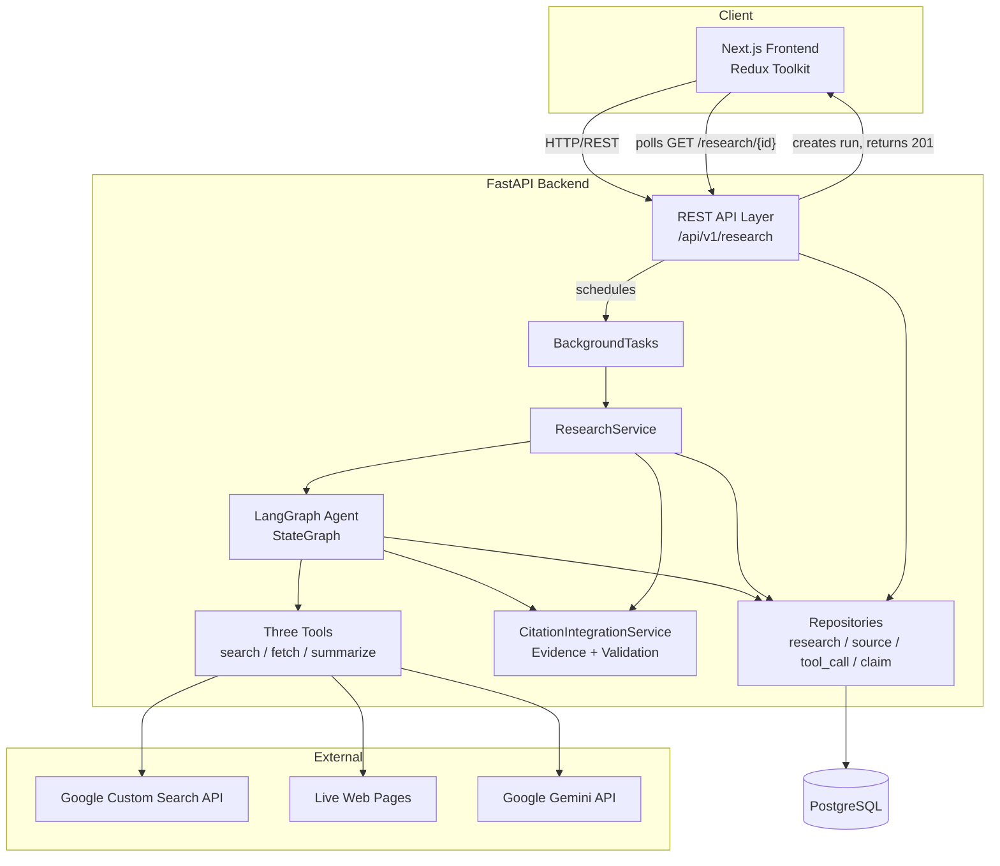
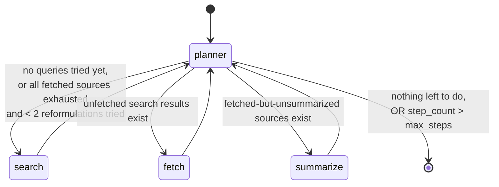
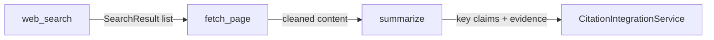
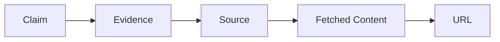
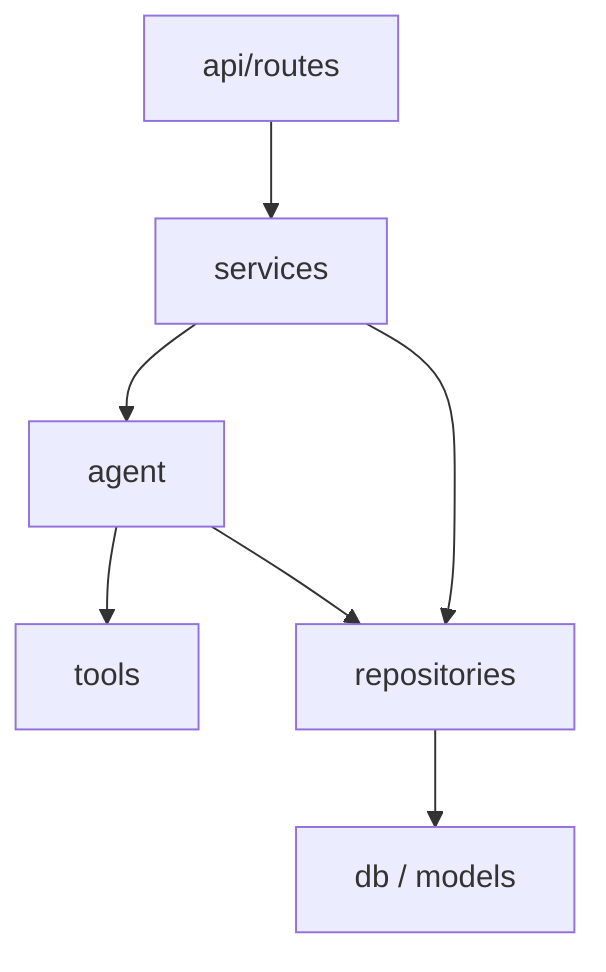
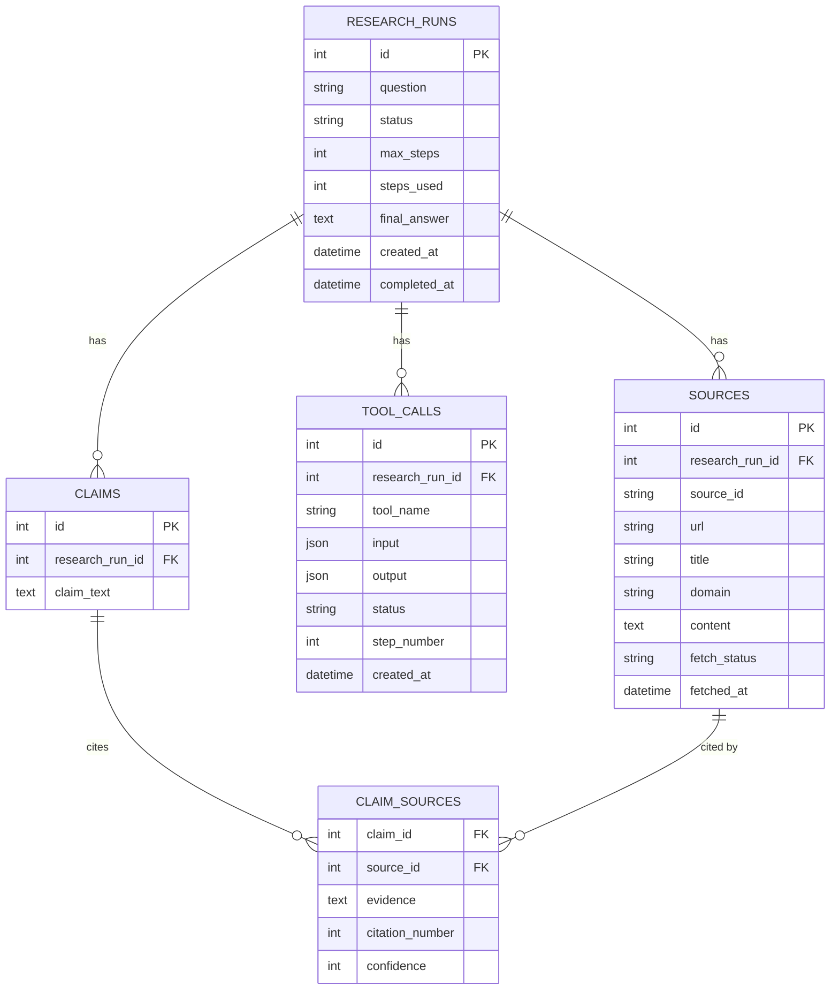

# ResearchPilot AI — Complete System Design & Architecture

**Version:** 1.0
**Status:** Production-Ready
**Last Updated:** September 4, 2026

---

## Table of Contents

1. [Project Overview](#1-project-overview)
2. [Problem Statement](#2-problem-statement)
3. [Project Goals and Objectives](#3-project-goals-and-objectives)
4. [Functional Requirements](#4-functional-requirements)
5. [Non-Functional Requirements](#5-non-functional-requirements)
6. [Complete System Architecture](#6-complete-system-architecture)
7. [Agentic AI Architecture](#7-agentic-ai-architecture)
8. [LangGraph State Machine](#8-langgraph-state-machine)
9. [Three-Tool Architecture](#9-three-tool-architecture)
10. [RAG / Evidence Pipeline](#10-rag--evidence-pipeline)
11. [Citation and Claim Traceability](#11-citation-and-claim-traceability)
12. [Gemini AI Architecture](#12-gemini-ai-architecture)
13. [Backend Architecture](#13-backend-architecture)
14. [Frontend Architecture](#14-frontend-architecture)
15. [PostgreSQL Data Architecture](#15-postgresql-data-architecture)
16. [Security + Failure Handling](#16-security--failure-handling)
17. [Testing + Docker + CI/CD](#17-testing--docker--cicd)
18. [Complete End-to-End Workflow + Future Scalability](#18-complete-end-to-end-workflow--future-scalability)

---

## 1. Project Overview

ResearchPilot AI is a full-stack, tool-using research agent. A user submits
a natural-language research question; the system autonomously searches the
web, fetches candidate pages, extracts evidence from them with an LLM, and
synthesizes a final answer in which every factual claim is traceable back to
a specific fetched source. The agent's control flow is implemented as an
explicit **LangGraph** state machine rather than an ad-hoc loop, and every
step is persisted to PostgreSQL so the full research trace — which tools ran,
what they returned, which sources were used, and which claims cite which
sources — is auditable after the fact.

The system is composed of three deployable units:

| Component | Technology | Responsibility |
|---|---|---|
| **Backend API + Agent** | FastAPI, LangGraph, SQLAlchemy 2.x | Orchestrates research, exposes REST API |
| **Frontend** | Next.js 14 (App Router), Redux Toolkit | Lets users submit questions and watch research happen live |
| **Database** | PostgreSQL 16 | Durable, queryable record of every run, source, tool call, and citation |

The defining design constraint is **evidence grounding**: the system is not
allowed to answer from the LLM's parametric memory. Every claim in the final
answer must resolve to a `Claim -> ClaimSource -> Source -> fetched content ->
URL` chain, enforced programmatically, not merely requested via prompt.

---

## 2. Problem Statement

General-purpose LLM chat interfaces answer research questions directly from
model memory. This produces three well-known failure modes:

1. **Hallucination** — plausible-sounding but false claims, with no way for
   the reader to check them.
2. **Staleness** — the model's knowledge cutoff means anything that changed
   afterward is either missed or (worse) confidently misreported.
3. **Unverifiability** — even correct answers give the reader no path to the
   primary source, so trust has to be taken on faith.

A tool-using agent that actually searches, fetches, and cites current web
sources addresses all three — but only if the tool use is real (not
simulated), the citations are real (traceable to content the system actually
fetched, not fabricated), and the agent is guaranteed to terminate rather
than loop indefinitely burning API calls. ResearchPilot AI is built to solve
exactly this problem, with the guarantees enforced in code rather than left
to the LLM's good behavior.

---

## 3. Project Goals and Objectives

**Primary goals**

- Autonomous, multi-step research over live web sources using three
  well-defined tools (search, fetch, summarize).
- A real LangGraph state machine — not a `while` loop — driving tool
  selection, with a **hard, code-enforced step limit** that guarantees
  termination regardless of what the LLM or tools do.
- Every claim in the final answer traceable to a specific fetched source
  (**NO SOURCE = NO CLAIM**), validated in a dedicated citation-validation
  stage before the answer is returned.
- Graceful degradation under every realistic failure mode (search API down,
  page unreachable, LLM call fails, no evidence found) — the system should
  never crash and never fabricate an answer when it has nothing to ground it
  in.
- A portfolio-quality, testable, containerized full-stack deliverable: typed
  Python and TypeScript, migrations, CI, Docker Compose, and an actual UI
  that shows the agent's reasoning as it happens, not just a final answer.

**Non-goals**

- General conversational chat — the system exists to answer research
  questions with citations, not to be a general assistant.
- Multi-tenant auth/RBAC — out of scope for this deliverable (see §16 for
  what security *is* in scope).
- A vector database / semantic retrieval layer — deliberately **not**
  included; see §10 for the reasoning.

---

## 4. Functional Requirements

| ID | Requirement |
|---|---|
| FR-1 | User submits a research question (and optional max-step budget) via `POST /api/v1/research`. |
| FR-2 | The agent selects and calls one of three tools (web_search, fetch_page, summarize) at each step, based on the current research state. |
| FR-3 | Web search returns structured results (source id, title, URL, snippet, domain) and handles empty results, API failure, and timeout without crashing. |
| FR-4 | Fetch retrieves and cleans a specific page's content; a source is never treated as evidence unless it was actually, successfully fetched. |
| FR-5 | Summarization extracts a summary, key claims, and evidence snippets from fetched content using Gemini, and is retried once on failure before being marked as failed. |
| FR-6 | The agent enforces a hard maximum step count; on reaching it, it stops calling tools and generates the best-supported answer from whatever evidence has been collected so far. |
| FR-7 | Every claim in the final answer is validated against fetched evidence before being persisted or returned; unsupported claims are dropped. |
| FR-8 | All research state (sources, tool calls, claims, citations) is queryable after the fact via `GET /api/v1/research/{id}`, `.../sources`, `.../tools`, `.../claims`. |
| FR-9 | The frontend shows live research progress (current step, tools used, sources found) while a run is in progress, then switches to a results view with the final answer, citations, and full evidence trail. |
| FR-10 | Failures at any stage (search, fetch, summarize, LLM synthesis) are surfaced to the user as an honest status, never as a silently wrong answer. |

---

## 5. Non-Functional Requirements

- **Reliability** — the agent must *always* terminate; termination is
  enforced by a plain integer comparison in the planner node, not by asking
  the LLM to stop (see §8).
- **Traceability** — every persisted claim carries a citation number, source
  id, and evidence snippet; nothing is citable that wasn't fetched.
- **Testability** — tools, agent graph, citation logic, and API are each
  unit- and integration-tested with all external network calls mocked, so
  the suite runs deterministically offline (36 backend tests, 10 frontend
  tests, all passing — see §17).
- **Observability** — structured JSON logging with a request ID threaded
  through every log line via middleware, so a single request's full
  lifecycle can be grepped out of the logs.
- **Portability** — SQLite (aiosqlite) for zero-config local development and
  tests, PostgreSQL for production, switched purely via `DATABASE_URL`.
- **Security** — no secrets in source control, SSRF-aware URL validation
  before any fetch, sanitized error responses (see §16).
- **Performance** — async I/O throughout the backend (httpx, asyncpg,
  SQLAlchemy async engine) so a slow fetch or LLM call doesn't block the
  event loop.

---

## 6. Complete System Architecture



**Request lifecycle:** the frontend `POST`s a question; the API layer
creates a `research_runs` row (status `running`) and immediately returns
`201` with the run id, scheduling the actual agent execution as a FastAPI
`BackgroundTask`. The frontend then polls `GET /api/v1/research/{id}` (and
the `/sources`, `/tools`, `/claims` sub-resources) every few seconds, driving
a live "workspace" view until the status flips to `completed` or `failed`.
This request/response split is what lets the API return instantly instead of
blocking on a multi-step, multi-second agent run.

---

## 7. Agentic AI Architecture

The agent is a single LangGraph `StateGraph` (`backend/app/agent/graph.py`)
with four nodes: `planner`, `search`, `fetch`, `summarize`. `planner` is the
only node with routing authority — after every tool call, control returns to
`planner`, which re-examines the accumulated state and decides what happens
next.

**Design principle: pure state, injected dependencies.** The graph's state
(`ResearchState`, a `TypedDict`) contains only JSON-serializable data —
question, step count, search results, fetched content, error list. Database
sessions, repositories, and the citation service are *not* part of the
state; they're closed over by the node functions via an `AgentContext`
object built once per run. This keeps the graph itself replayable and easy
to unit test with mocked tools (see `tests/test_agent_graph.py`), while still
letting each node persist its work immediately as it happens.

**Why not a while-loop?** A hand-rolled loop conflates control flow,
business logic, and persistence in one function, and makes it easy to
accidentally special-case termination. LangGraph forces the termination
condition (`planner` routing to `END`) to be an explicit, inspectable edge
in a declared graph, and gives every intermediate state a name — which is
also what makes the hard step limit in §8 straightforward to test in
isolation.

---

## 8. LangGraph State Machine



**Hard step limit (guaranteed termination).** `planner_node` increments
`step_count` on every entry — it is the *only* place this happens — and the
very first thing it does is compare against `max_steps`:

```python
step_count = state.get("step_count", 0) + 1
state["step_count"] = step_count
if step_count > state["max_steps"]:
    state["next_action"] = "finish"
    state["status"] = "step_limit_reached"
    return state
```

This is a plain integer comparison, not an LLM instruction — the graph
*cannot* route anywhere except `END` once the limit is exceeded, regardless
of what tools return or what the LLM "wants" to do. `ResearchService` also
sets LangGraph's own `recursion_limit` generously above `max_steps` purely
as a second independent backstop; the test suite verifies that termination
is caused by `step_count`, not by hitting that backstop (see
`test_hard_step_limit_guarantees_termination`).

**Planner decision logic**, in order:

1. No search performed yet → `search`.
2. Search results exist that haven't been fetched → `fetch` (up to
   `MAX_FETCH_PER_QUERY = 3` results per query are queued, so one broad
   query can't consume the whole step budget).
3. Fetched-and-successful sources exist that haven't been summarized →
   `summarize`.
4. No successful fetches yet, and fewer than `MAX_QUERY_REFORMULATIONS = 2`
   reformulated queries have been tried → `search` again with a reformulated
   query (this is the failure-recovery path for empty/poor search results).
5. Otherwise → `finish`.

---

## 9. Three-Tool Architecture



**Tool 1 — Web Search** (`app/tools/web_search.py`) calls the Google Custom
Search API via `httpx`. Returns `WebSearchResponse(success, results,
result_count, error)`. Handles: successful search, empty results (returns
`success=True, result_count=0`, not an error), HTTP/API failure (`success=False,
error="API error"`), and timeout (`success=False, error` mentions timeout) —
all covered by `tests/test_tools.py`.

**Tool 2 — Fetch Page** (`app/tools/fetch_page.py`) validates the URL
(scheme + SSRF checks, see §16) before ever making a request, fetches via
`httpx`, strips markup, and returns `FetchPageResponse(success, source_id,
url, title, content, word_count, fetch_status, error)`. `fetch_status` is
one of `success`, `error`, `timeout`, `forbidden` (SSRF-blocked). A source
whose fetch didn't succeed is never passed to summarization or cited — this
is enforced both in the agent graph (`fetch_node` only queues successfully
fetched sources for `summarize_node`) and again in `ResearchService`
(citations only attach to sources with `fetch_status == "success"`).

**Tool 3 — Summarize / Evidence Extraction** (`app/tools/summarize.py`) sends
fetched content plus the research question to Gemini and parses a structured
JSON response into `SummarizeResponse(success, source_id, summary,
key_claims)`, where each `KeyClaim` has `claim`, `evidence`, and
`confidence`. On a malformed (non-JSON) response or an API failure, it
returns `success=False`; the agent graph retries once, then records the
failure and moves on rather than blocking the run.

---

## 10. RAG / Evidence Pipeline

```mermaid
flowchart LR
    Q[User Question] --> S[Search]
    S --> R[Search Results]
    R --> F[Fetch Pages]
    F --> CL[Clean Documents]
    CL --> EX[Evidence Extraction<br/>Gemini summarize]
    EX --> EV[Store Source Evidence<br/>CitationIntegrationService]
    EV --> MAP[Build Claim/Evidence Mapping]
    MAP --> GEN[Generate Answer<br/>Gemini synthesis]
    GEN --> VAL[Validate Citations]
    VAL --> OUT[Return Answer + Citations]
```



**Why no vector database.** A vector store earns its place when retrieval
needs to search over a large, persistent corpus of previously-ingested
documents by semantic similarity. ResearchPilot's evidence set for any
single research run is small (a handful of freshly fetched pages, capped by
the step budget) and lives only for the duration of that run — there's
nothing to build an ANN index over. `CitationIntegrationService` holds
evidence in an in-memory dict (`evidence_map`) keyed by source, which is
exactly the right amount of infrastructure for "ground the answer in the
handful of pages we just fetched." Adding pgvector/FAISS/Pinecone here would
be complexity with no retrieval problem to solve — the actual retrieval
step is the web search tool itself. If ResearchPilot were extended to reuse
evidence *across* research runs (a persistent knowledge base), that would be
the point at which a vector store becomes genuinely justified, and it could
be added as an additional evidence source feeding the same
`CitationIntegrationService` without changing the rest of the pipeline.

**Grounding, concretely.** `_generate_answer` in `ResearchService` builds
its Gemini prompt *only* from `citation_service.evidence_map` — the model
never sees the raw question without also seeing the evidence, and is
instructed to include nothing not directly supported by it. If the Gemini
call itself fails (no network, bad key, quota), `_extractive_fallback_answer`
produces a safe, purely extractive answer built directly from the evidence
sentences rather than either fabricating one or leaving the run stuck.

---

## 11. Citation and Claim Traceability



**NO SOURCE = NO CLAIM** is enforced at three independent layers, not just
requested via prompt:

1. **Agent graph** — `fetch_node` only records a source as fetched
   (`state["fetched"][id]`) with `success=True`/`False` reflecting the real
   HTTP outcome; `summarize_node` only summarizes sources where
   `data.get("success")` is true.
2. **CitationIntegrationService.validate_answer()** — parses the generated
   answer into claim-like sentences, matches each one against the evidence
   map, and marks a claim `verified` only if it can attribute it to
   evidence from an actually-fetched source. Unverified claims are excluded
   from `get_citations_section()`.
3. **ResearchService._persist_claims()** — a final belt-and-braces check at
   the persistence layer: even for a claim the validator marked verified, it
   re-fetches the `Source` row and skips citing it unless
   `source.fetch_status == "success"`.

Every persisted `Claim` has one or more `ClaimSource` rows, each carrying a
`citation_number` (matching the `[1]`, `[2]`, `[3]` markers in the final
answer text), the source's database id, an evidence snippet, and an
optional confidence score. `GET /api/v1/research/{id}/claims` returns this
whole chain (claim text → citations → source id/url/title) so the frontend's
citation UI (§14) can render "claim → evidence → URL" without any further
joins.

---

## 12. Gemini AI Architecture

Google Gemini is the **only** LLM provider in this system (per project
constraints) and is used in exactly two places:

1. **Summarization** (`SummarizationTool._call_gemini`) — structured
   extraction of `{summary, key_claims: [{claim, evidence, confidence}]}`
   from one fetched page's content, in the context of the research
   question.
2. **Final answer synthesis** (`ResearchService._generate_answer`) — a
   single call that turns the accumulated evidence into a coherent prose
   answer, explicitly instructed to include nothing not directly supported
   by the evidence block it's given.

The Gemini client is configured once via `settings.gemini_api_key` /
`settings.gemini_model` (env-driven, see §16), isolated behind these two
call sites so swapping the underlying SDK call later touches only two
functions. Both call sites have an explicit failure path — a bad/failing
Gemini call never crashes the run; it degrades to a retry (summarization) or
an extractive fallback (final answer), per §10.

---

## 13. Backend Architecture



```
backend/
├── app/
│   ├── main.py            FastAPI app, middleware, startup (create tables)
│   ├── core/               config.py (Pydantic Settings), logging.py
│   ├── api/routes/         research.py — the 6 REST endpoints
│   ├── schemas/            Pydantic v2 request/response + tool I/O schemas
│   ├── models/ (see db/)   ORM models: ResearchRun, Source, ToolCall, Claim, ClaimSource
│   ├── repositories/       research_, source_, tool_call_, claim_repository.py
│   ├── services/           research_service.py (orchestration),
│   │                       citation_integration.py (evidence + validation)
│   ├── agent/               state.py (TypedDict), graph.py (LangGraph StateGraph)
│   ├── tools/               web_search.py, fetch_page.py, summarize.py
│   ├── db/                  base.py, models.py, database.py (async engine/session)
│   └── utils/                urls.py (SSRF checks), text.py
└── tests/                    36 tests across tools, agent, citations, API
```

Each layer only talks to the layer directly below it: routes call services,
services call the agent and repositories, the agent calls tools and
repositories, repositories are the only layer that touches SQLAlchemy
models directly. This is what makes it possible to unit-test the agent graph
against mocked tools without spinning up the API layer at all, and to
integration-test the API against mocked tools without touching the graph's
internals.

---

## 14. Frontend Architecture

Next.js 14 **App Router**, TypeScript, Tailwind, Redux Toolkit.

```
frontend/src/
├── app/
│   ├── layout.tsx           Root layout, wraps app in <Providers>
│   ├── providers.tsx        Client component: <Provider store={store}>
│   ├── page.tsx              Home (renders HomePage)
│   ├── api/health/route.ts   Container liveness endpoint
│   └── research/[id]/page.tsx  Swaps Workspace <-> Results based on status
├── components/
│   ├── HomePage.tsx           Question form, max-steps slider
│   ├── ResearchWorkspace.tsx  Live progress: status, steps, tool timeline, sources
│   └── ResearchResults.tsx    Final answer, citations, full source list
├── store/
│   ├── index.ts                configureStore
│   └── researchSlice.ts         research run state + reducers
└── hooks/
    └── useResearchAPI.ts        startResearch / pollResearch / fetch* thin API layer
```

`useResearchAPI.pollResearch` drives the live workspace: on an interval, it
`GET`s the run status plus sources/tools/claims and dispatches them into
Redux, stopping once status is terminal (`completed` / `failed` /
`step_limit_reached`). `/research/[id]/page.tsx` reads `status` from Redux
and renders `ResearchWorkspace` while running, swapping to `ResearchResults`
once finished — giving the "clearly demonstrate the system is using tools"
requirement a literal, live timeline of tool calls as they're persisted by
the backend.

---

## 15. PostgreSQL Data Architecture



SQLAlchemy 2.x declarative models (`app/db/models.py`) + Alembic migrations
(`backend/alembic/versions/001_initial_schema.py`) define this schema.
`DATABASE_URL` picks the driver: `sqlite+aiosqlite://` for local dev/tests
(zero setup, `StaticPool` keeps the in-memory DB alive for the process),
`postgresql+asyncpg://` for the running app in production. Alembic itself
runs synchronously, so `alembic/env.py` swaps in the matching *sync* driver
(`sqlite://` / `postgresql+psycopg2://`) purely for the migration run — the
app never uses that sync engine.

---

## 16. Security + Failure Handling

**Secrets** — `GEMINI_API_KEY`, `SEARCH_API_KEY`, `SEARCH_ENGINE_ID`,
`SECRET_KEY`, and the database credentials embedded in `DATABASE_URL` are
all environment-driven (`.env`, never committed; `.env.example` documents
every variable) and read once via `Settings` (Pydantic Settings).

**SSRF protection** — `app/utils/urls.py` validates every fetch target
before any request is made: only `http`/`https` schemes are allowed, and the
hostname is checked against private, loopback, and link-local IP ranges.
*Known limitation:* this check is against the literal hostname, not a
resolved IP, so a DNS-rebinding attack (a public hostname that resolves to a
private IP) isn't caught by this layer alone — see §18 for a note on
hardening this with resolve-then-validate in production.

**No leaked stack traces** — the global exception middleware
(`app/middleware.py`) catches unhandled exceptions and returns a generic
`500` with a request id, logging the real traceback server-side only.

**Failure handling matrix** (all exercised in tests):

| Failure | Behavior |
|---|---|
| Search returns nothing / errors | Recorded in `tool_errors`, planner reformulates the query (up to 2 retries), then finishes rather than looping |
| Fetch fails (timeout, 4xx/5xx, SSRF-blocked) | Source marked failed in DB, never summarized or cited, agent moves to the next source |
| Summarize fails (bad JSON, Gemini error) | Retried once, then recorded as failed; run continues with whatever evidence it has |
| Final-answer Gemini call fails | Falls back to a purely extractive answer built from evidence text — never fabricated |
| No evidence gathered at all | Run marked `failed` with an honest "insufficient evidence" message — **no answer is generated** |
| Step limit reached | Planner forces `finish`; the best-supported answer from evidence collected so far is generated and returned with `status = step_limit_reached` reflected via `steps_used` |
| Malformed tool response | Caught at the tool boundary (`try`/`except` around parsing), returned as `success=False` rather than raising into the graph |

---

## 17. Testing + Docker + CI/CD

**Backend — 36 passing tests** (`pytest`, all async via `pytest-asyncio`,
zero live network calls — every external call is monkeypatched):

- `test_tools.py` (13) — search success/empty/timeout/API-failure; fetch
  success/SSRF-block/404/timeout/invalid-URL; summarize
  success/malformed-response/Gemini-failure.
- `test_agent_graph.py` (4) — tool selection, full multi-tool happy path,
  **hard step-limit termination guarantee**, search-failure recovery via
  reformulation.
- `test_api.py` (6) — health, validation errors, 404, full workflow
  end-to-end (create → background agent run → poll → verify sources/tools/
  claims/citations all correct via HTTP), failing-search → honest failure.
- Plus 13 pre-existing tests for config, models, repositories, utils, and
  basic tool wiring.

**Frontend — 10 passing tests** (Jest + Testing Library): form rendering
and validation, workspace stats/timeline rendering, results/citations
rendering, empty-answer state.

**Docker** — `docker-compose.yml` defines `postgres` (with a healthcheck
gating backend startup), `backend` (runs `alembic upgrade head` then
`uvicorn`), and `frontend` (multi-stage Next.js build). Both Dockerfiles run
as non-root users and define container healthchecks
(`/health` for the backend, `/api/health` for the frontend).

**CI/CD** — three GitHub Actions workflows: `backend.yml` (install, lint,
type-check, `pytest` against a real Postgres service container, build the
Docker image), `frontend.yml` (install, lint, type-check, `jest`, build,
build the Docker image), `docker.yml` (build-and-push both images on
`main`/tags). See the Backend/Frontend documentation for the exact bugs
found and fixed while getting these green (async DB driver mismatch in CI,
missing ESLint config, missing jest-dom type declarations).

---

## 18. Complete End-to-End Workflow + Future Scalability

**End-to-end, concretely:**

1. `POST /api/v1/research {"question": "...", "max_steps": 8}` → API creates
   a `research_runs` row, returns `201` immediately, schedules
   `ResearchService.run_research` as a background task.
2. `ResearchService` builds a fresh `AgentContext` + compiled LangGraph
   graph and calls `graph.ainvoke(initial_state)`.
3. The graph runs `planner → search → planner → fetch → planner →
   summarize → planner → ... → finish`, persisting a `sources` row per
   discovered source, a `tool_calls` row per tool invocation, and feeding
   `CitationIntegrationService` as it goes — bounded by `max_steps`.
4. `ResearchService` synthesizes the final answer from the accumulated
   evidence via Gemini (or falls back extractively), validates citations,
   persists `claims`/`claim_sources`, and marks the run `completed` (or
   `failed`, honestly, if there wasn't enough evidence).
5. The frontend, which has been polling since step 1, sees the terminal
   status and renders the results view: answer with `[1] [2] [3]` markers,
   a citations section, and the full source/evidence trail.

**Future scalability directions** (explicitly out of scope for this
deliverable, noted here rather than partially built):

- **Persistent cross-run evidence** — if the same domain/question space is
  researched repeatedly, a pgvector column on `sources.content` would let
  new runs retrieve previously-fetched evidence before spending a step on a
  live fetch. This is the point at which the "no vector DB" decision in §10
  would flip, precisely because there'd finally be a persistent corpus to
  index.
- **Streaming progress** — replacing polling with Server-Sent Events or a
  WebSocket would remove the polling interval latency in the workspace UI.
- **Parallel tool calls** — `fetch`/`summarize` for independent sources
  could run concurrently within a step instead of one-per-step, trading a
  more complex state shape for faster wall-clock completion within the same
  step budget.
- **Resolve-then-validate SSRF checks** — resolve the hostname and validate
  the resulting IP immediately before connecting (not just at request-build
  time) to close the DNS-rebinding gap noted in §16.
